## Stolen Flag 

### Description

> The city of Brussels discovered leaks and breaches in their system. The attackers used some advanced exfiltration methods to send data over large distances..Apparently the data is hidden in the following picture..
> 
> Are you able to retrieve it for us?

> I was building an IoT device supposed to print you a flag, it was finished when I decided to take my lunch break. When I came back the device the device wasn't printing flag anymore as you can see on the picture.
> My colleague told me that this is what happens when you don't change your credentials.
>
> Can you help me recover the flag my device was supposed to print ?

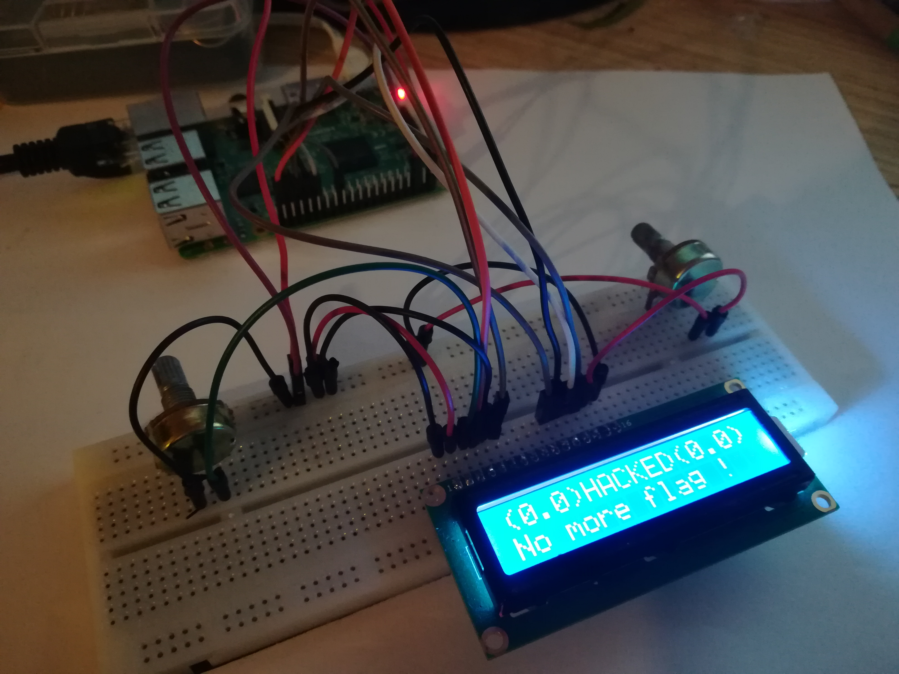

### Solution

Files given:
  - **traffic.pcap**: A capture of the network traffic at the moment of the attack.
  - **firmware.img**: Device firmware

#### traffic.pcap:
A first look at the network capture doesn’t give us much information, it’s only composed of TCP traffic whose content mostly look random. The communication occurs between two hosts, respectively 10.42.0.217 and 10.42.0.1. We can notice some structure in certain packets as they are starting with small numbers and a lot of 0s then a lot of random looking data. By looking closely, we can notice that the second number corresponds to the size of the random data following.
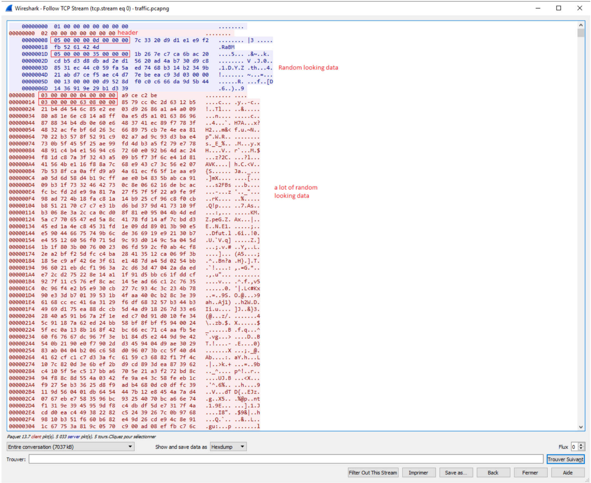

#### firmware.img
This file is quite big, by running binwalk we can notice some references to dietPi, after a quick look on google we find that this a lightweight Debian distribution for single board computer like the Raspberry Pi. We can deduce that a linux filesystem is present inside this firmware.

Using “fdisk -l”, we can list the different partition present in the firmware, the output confirms the presence of a linux partition and another boot partition (since the second partition is a FAT32 one).

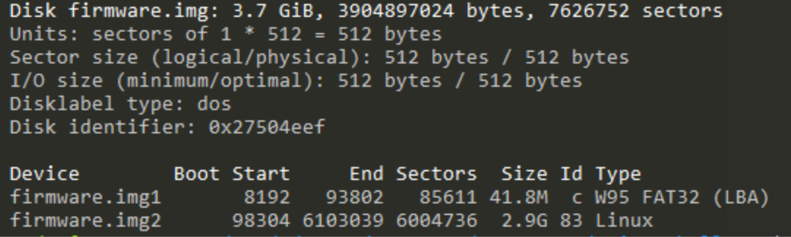

We can compute the second partition offset in bytes (sector size * start, 512 * 98304 = 50331648) and it using the command:

`mount -o loop,offset=50331648firmware.img /mnt/rootfs`
 
Once mounted we can browse the filesystem and notice that the root directory at / was the most recently modified (the root home directory.

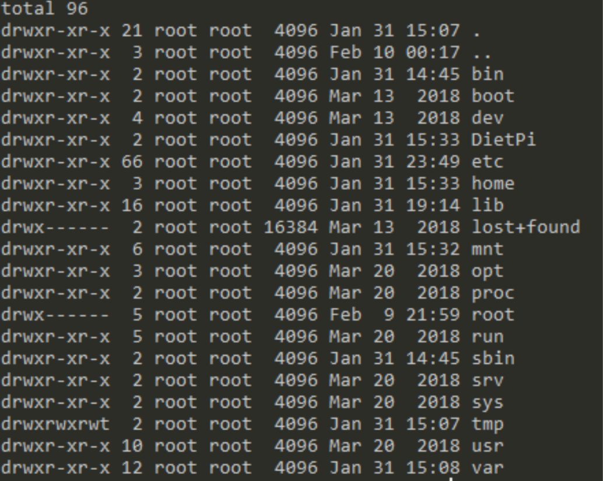

If we list the files present inside, we find a mp3 file, a hidden empty file, a python script and an executable, the rest of the files are nothing special.

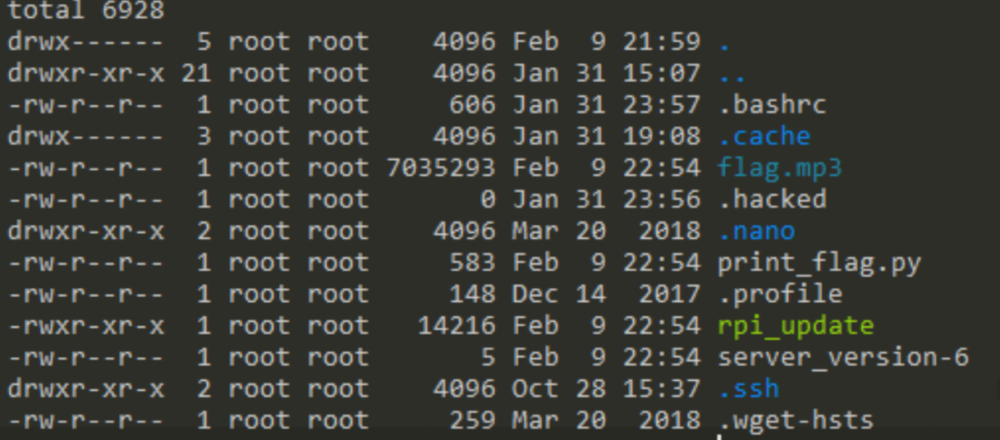

The mp3 is just the audio of the Rick Astley song “Never gonna give you up”, the python script contains code to print a “hacked” message to the LCD screen instead of the flag and the executable is an ARM executable not stripped.

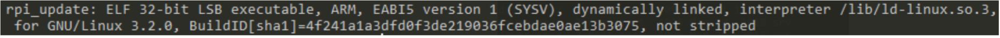

We don’t know yet the purpose of the binary, to get a rough idea of the functionalities we can use the “strings” tool.
We notice some interesting standard functions names which indicates that these functions are used. In particular, the network socket functionality directly indicates that this binary communicates with an endpoint. In addition, there are some more mysterious strings starting either with “cc” or “mod”.
Also there are the source files names : “main.c” and “cc.c”

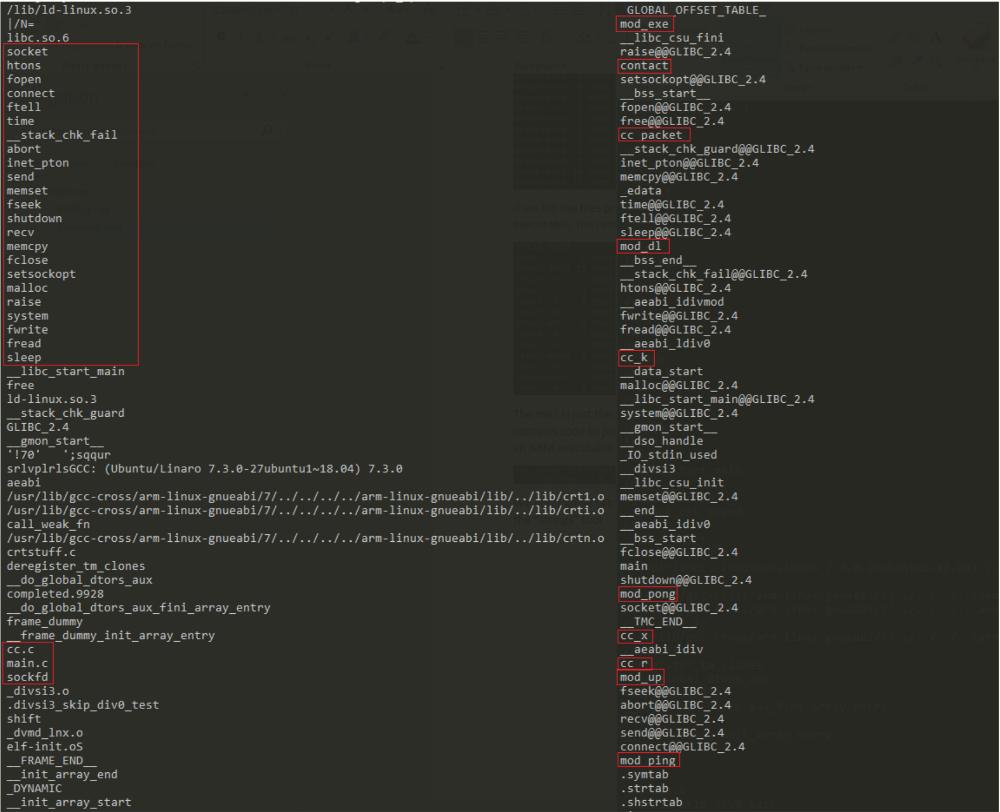

Next step is to disassemble this binary using some tool like IDA or Radare2. Since we don’t have an IDA Pro License to be able to disassemble ARM binary, we are going to use Cutter the GUI for Radare2.

The main function is a bit big, but it’s mainly composed of two parts, the execution is directed to one or the other part depending on one variable called “on”.

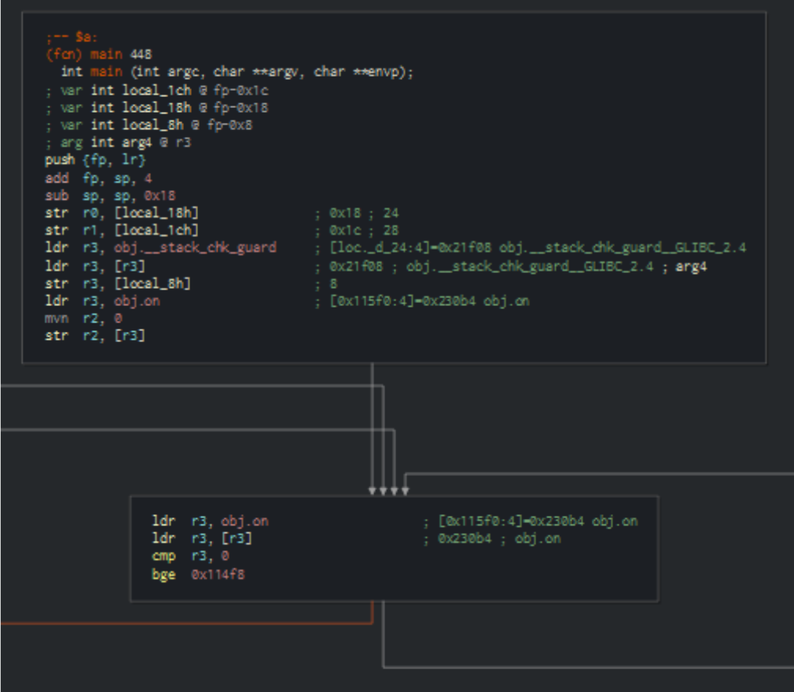

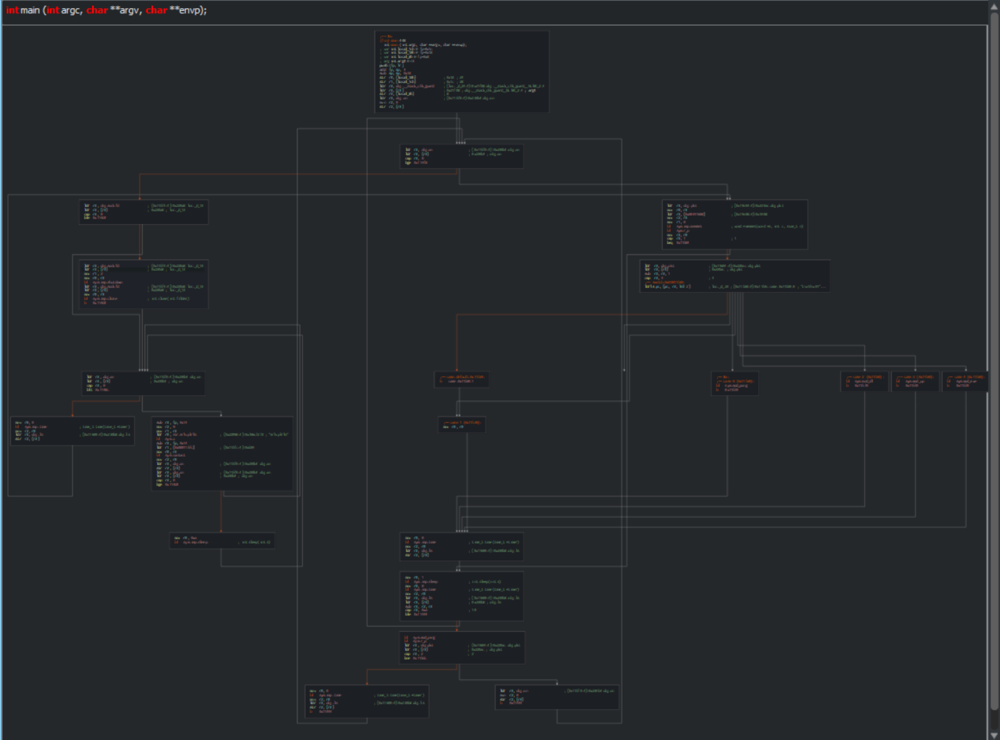

Depending if “on” is greater or equal to 0, a branch or another will be taken.

#### The left branch:
The left branch end with a big block, analysing it reveal a call to “z” and “contact” functions, the latter return value is stored in “on”.

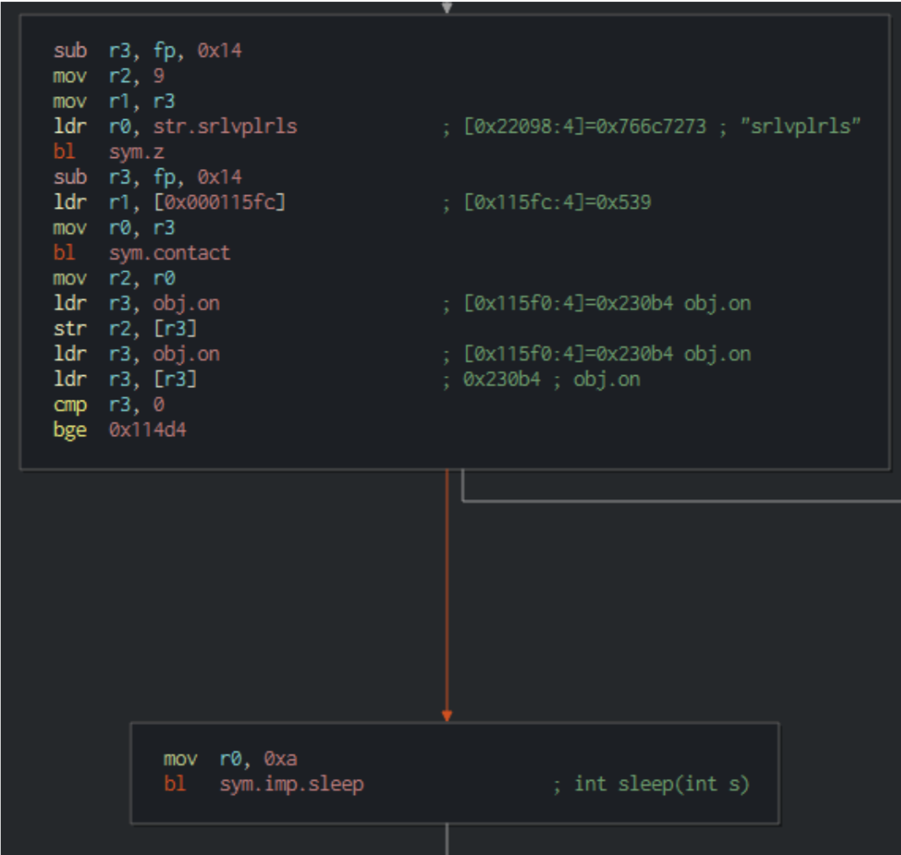

“Z” function is pretty easy to understand, It takes three arguments (notice the three str at the beginning, those are the three arguments which are passed through the registers), use one as a limit for a loop (local_18h), and the two others as array indexed by the loop iterator (local_8h). The value from the first array (local_10h) is xored with 0x42 and then store into the second array (local_14h).

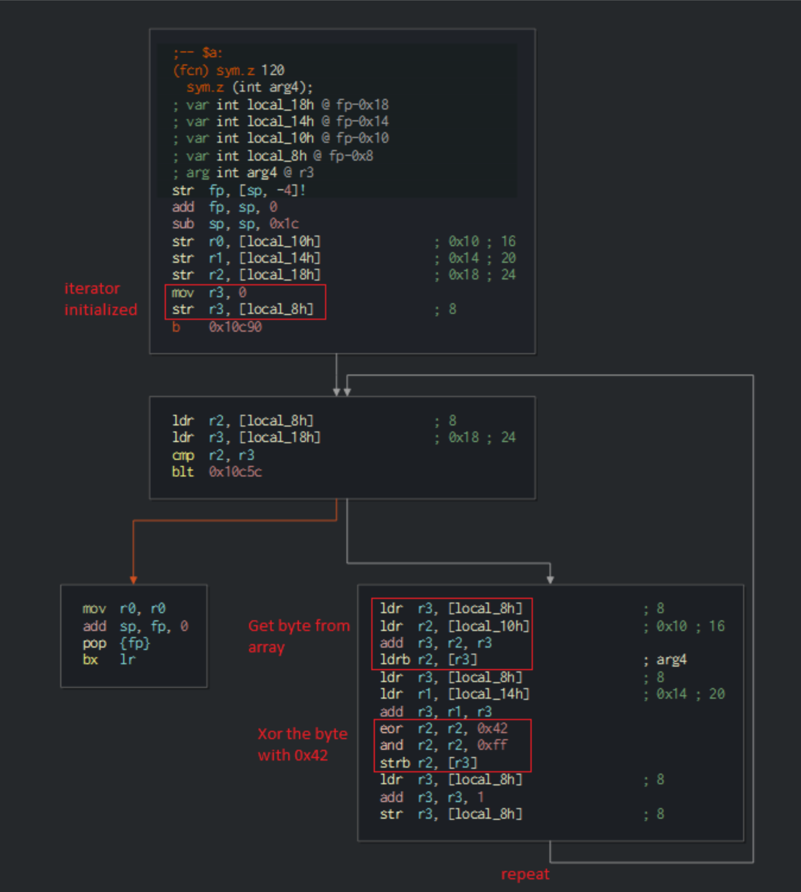

Probably a Deobfuscation function, we can verify that by taking the argument passed and xoring each byte with 0x42. Yup, we get an ip address one of two presents in the pcap file.

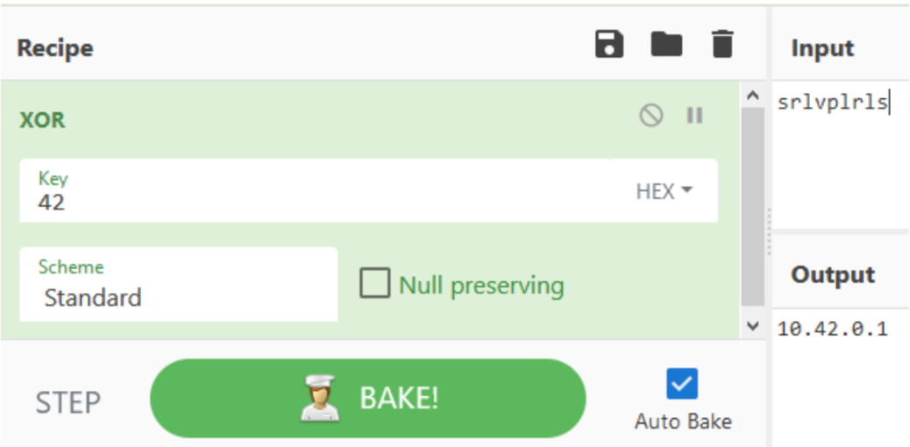

We can already search for more obfuscated string in the binary check checking the cross-references to this function. We can see that it’s used at one another place in the cc_packet function.

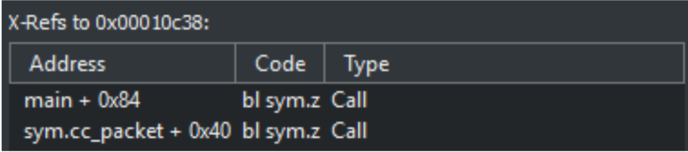

Let’s deobfuscate the string passed in argument at this call. The result is an interesting string “VerySecureKey13370”, looks like a password or a key, let’s put this aside for now

Back to contact function, in fact it’s just a big block preparing the socket then using it to connect the IP and the port passed as argument. If we look at the argument passed, we will see that the result of “z” is used and a fixed value at offset “0x000115fc” where we can find an integer of value “1337”, the port number.

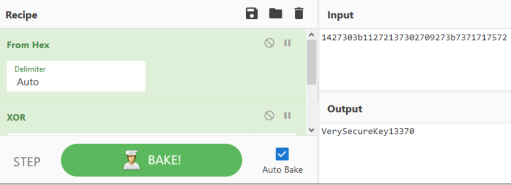

#### The right branch:

The right branch first starts with a block calling “memset” and “r_p”, there is also a reference to “pkt” which it’s probably a packet structure. The “memset” call receive as argument this structure as well as an integer (at offset 0x00011608) equal to 4104 then “rp” is called.

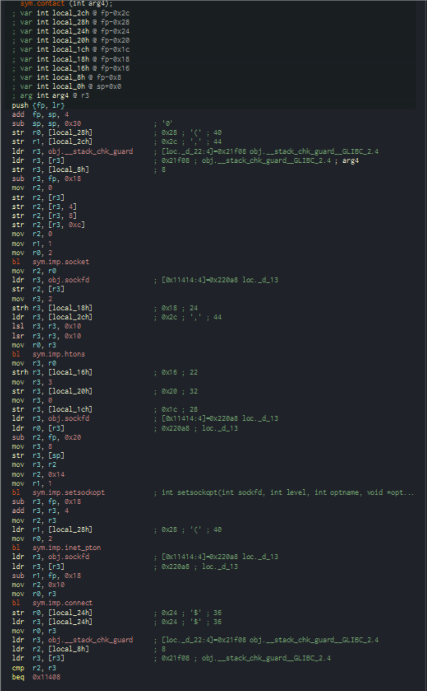

Let’s look at “r_p”, there are three calls to “recv” twos used to receive 4 bytes, respectively stored into the offset 0 and the offset 4 of the pkt structure. The last one is used to receive the number of bytes specified in “pkt+4” (offset 4 of structure pkt), therefore number received just before. The result of this last call is stored at offset 8. With this information we can guess some of the fields of the structure:

  - 0 : ?
  - 4 : data size
  - 8 : data

Afterwards, a call to “cc_packet” is made using the same value of r1 as argument. “cc_packet” was the function in which our second obfuscated string was used, let’s investigate it.

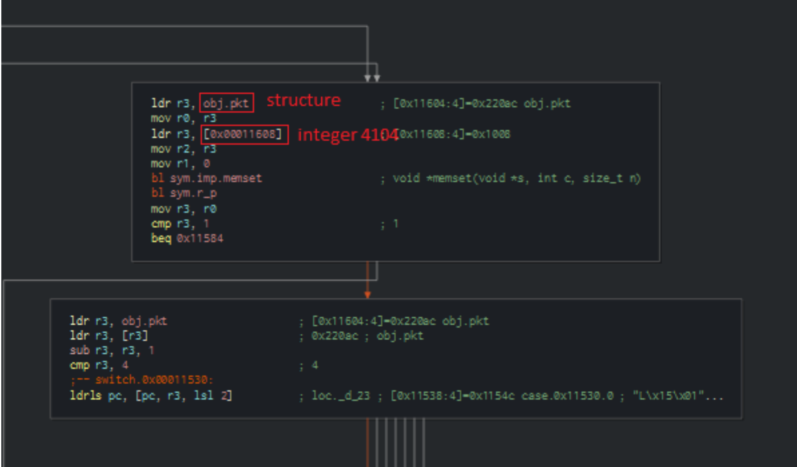

The “cc_packet” function is a bit tricky, we can observe the call to “z” then a bit later a call to “cc”. There is also a “v” referenced, which is like our “pkt” structure a static variable. This variable is incremented by one at the beginning of the function then stored again at the same place. Later after “z” it is reused and stored at “local_bh”(fp-0xb), the result of “z” stored at (fp-0x1c, since we store fp- 0x1c in r3 before the call to “z”). Now if we compute the distance between those two variables (0x1c – 0xb = 0x11) we get 17 but “z” received as argument 0x12 which is 18 which is the length of the string, therefore our string is located from 0x1c to 0x1c - 0x12 = 0xa, fp-0xb is then the index to the 18th element of our deobfuscated string. Remember our string “VerySecureKey13370”, the 18th element is 0 and is replaced at each call with “v” which is incremented each time “cc_packet” is called. If this string is a key, it means it changes every time.

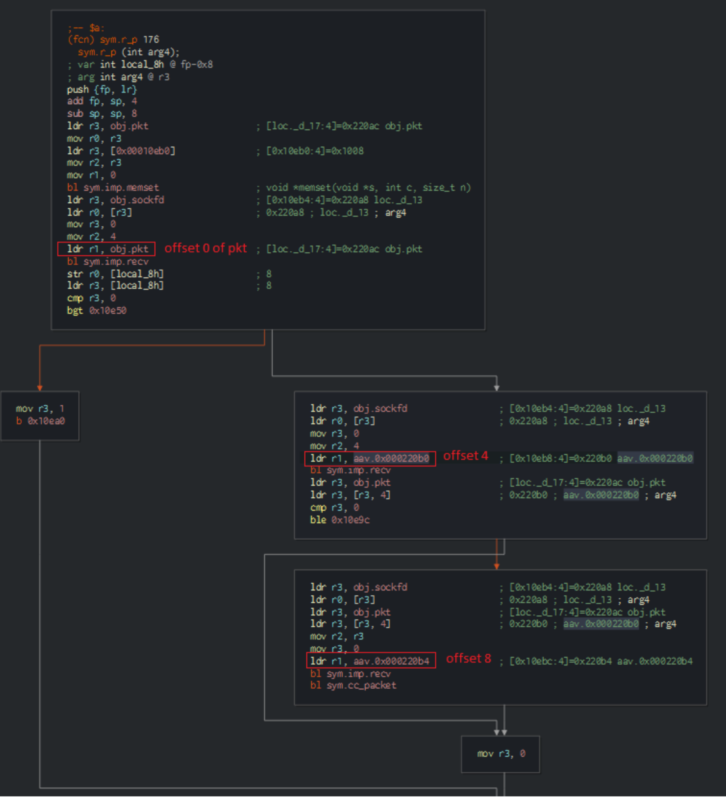

Now let’s look at “cc” which takes as argument the deobfuscated string (“key”), the size of the data field of pkt as well as the data field of pkt.

If we map the argument to their corresponding stack address and then look at where they are used, we can see that the “key” as well as the “key” length are used at the call to “cc_k” with a local variable. This local variable is then reused later at the call to “cc_r” with the data field of packet as well.

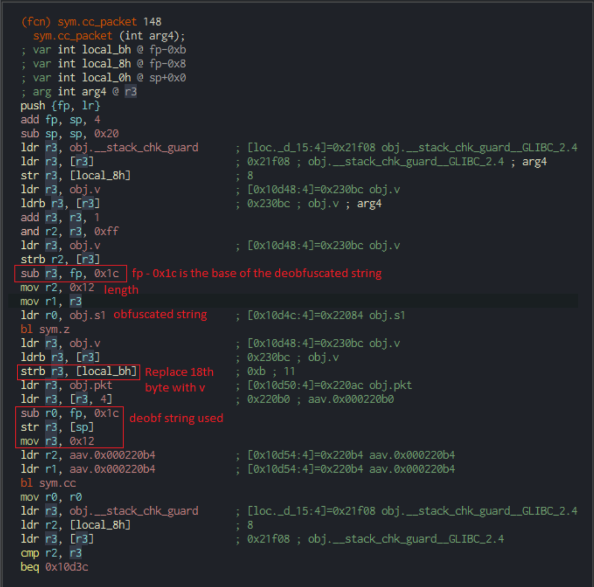

Looking at “cc_k” we can notice a loop and a call to “idivmod” used to perform the modulo operation, there are also a few “and” operation with value 0xff. There is also a loop using 0xff as a limit, this looks like crypto code .

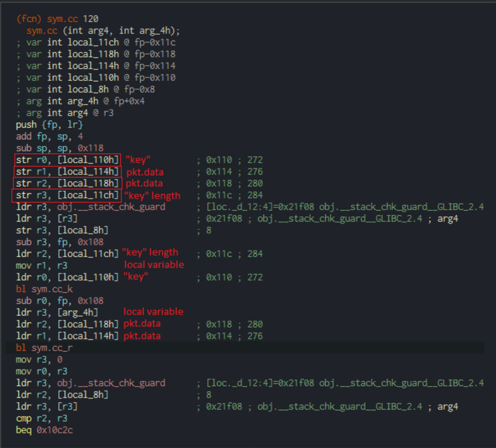

As for “cc_r”, it also contains multiple reference to and with 0xff as well as some shift operation and a xor.

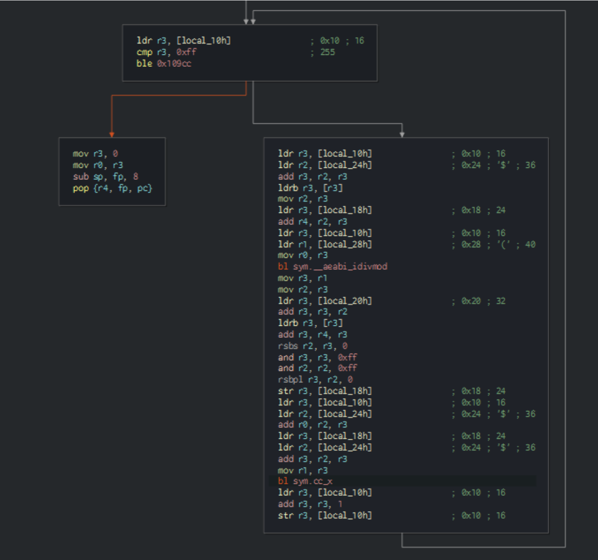

A good reflex when there are special operations like the loop over 255, “AND 255”, “XOR”, “Mod 255” is to search for them together on google.

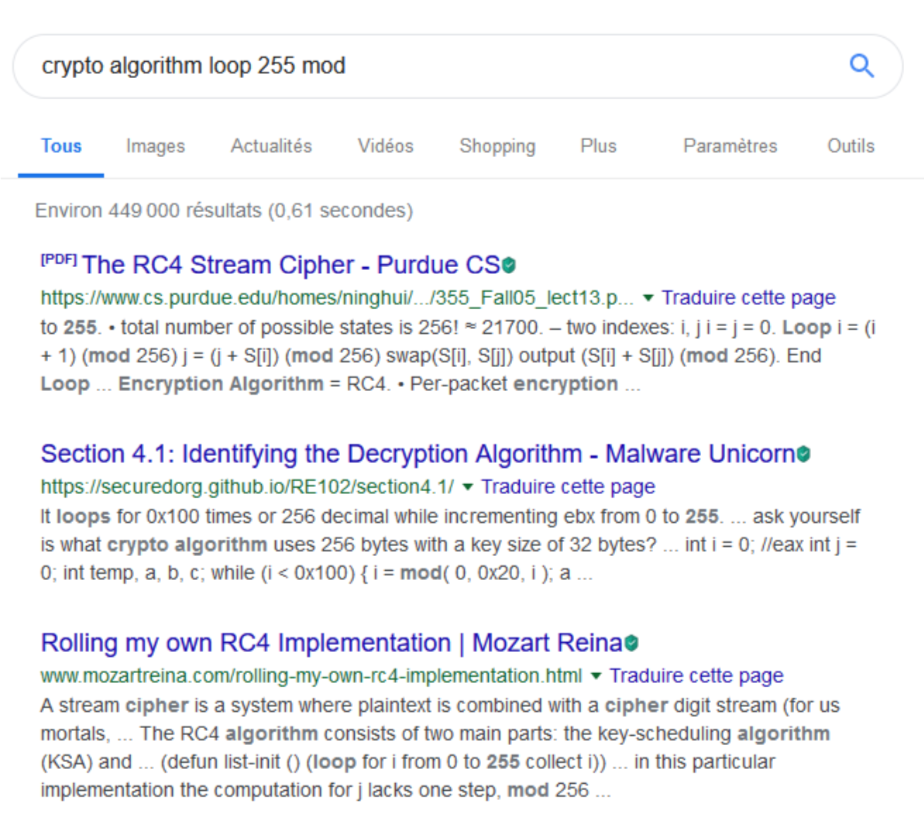

We can easily find possible algorithm, if we take a look at RC4 on Wikipedia (https://en.wikipedia.org/wiki/RC4), we can see that it’s composed from two parts : a key scheduling function and a keystream generation function. Looking at our “cc_k” function we can see two loops over 255 like the RC4 key scheduling function.
We can then deduce that we’re in the case of a RC4 encryption on the packet data since the buffer passed to “cc_r”, the encryption function is the data field from pkt. In addition, we know that the last character of the key is a counter incremented at each encryption.
Now we can try to decrypt some of the packet in the exchange, let’s start with the first ones since we know the counter starts at 1. The two first packets don’t include any encrypted payload, we can skip them since the counter is incremented only at encryption.

We can see that it worked and we get one of the command used by the attacker, now

Back to main where we can see that after the “r_p” function call, there is a switch case which can either call “mod_pong”, “mod_dl”, “mod_up” or “mod_exe”, each of these function is a module used to perform certain operation. We can guess which one by the name, it’s not necessary to reverse them but it will help understand the protocol even thought the most important was the crypto algorithm used and how the key is used.

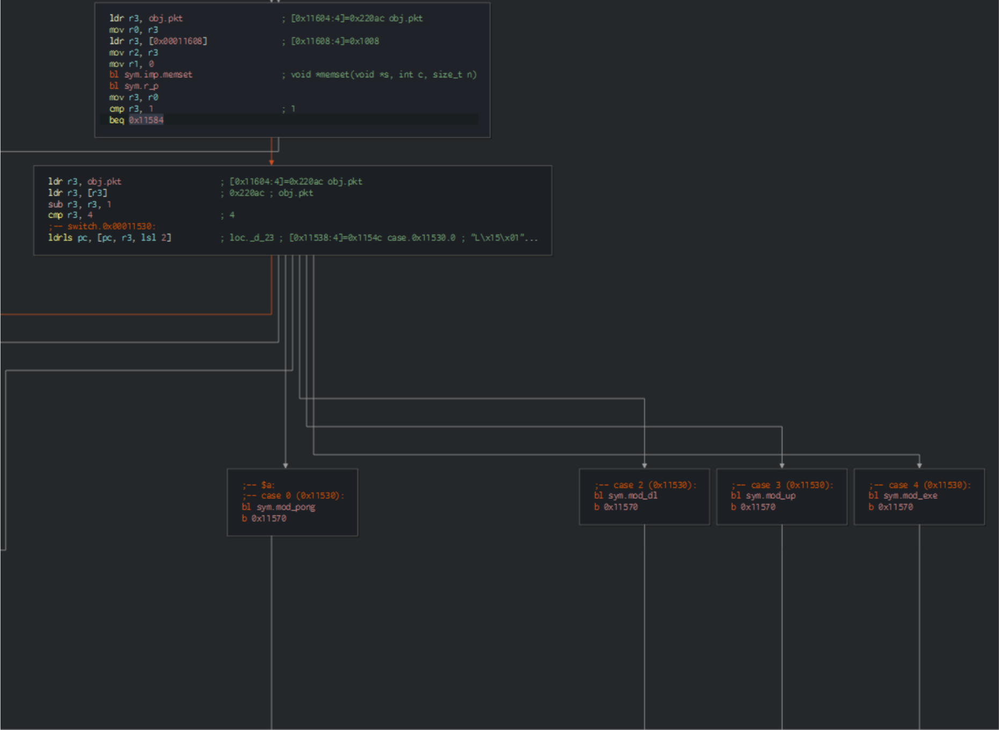

Below a short description of the different module

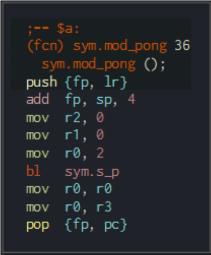

We can see that this function is fairly simple and only consists in a call to “s_p with 3 arguments. The function “s_p” itself is very similar to “r_p”, the three arguments are stored at different offsets in the “pkt” structure. First one is stored at offset 0, second one at offset 4 and third one is used as the source argument for “memcpy”, destination being the offset 8 of “pkt”. Then there is a call to
  
“cc_packet” used to encrypt the content of the packet and then a call to “send” with “pkt” as argument.

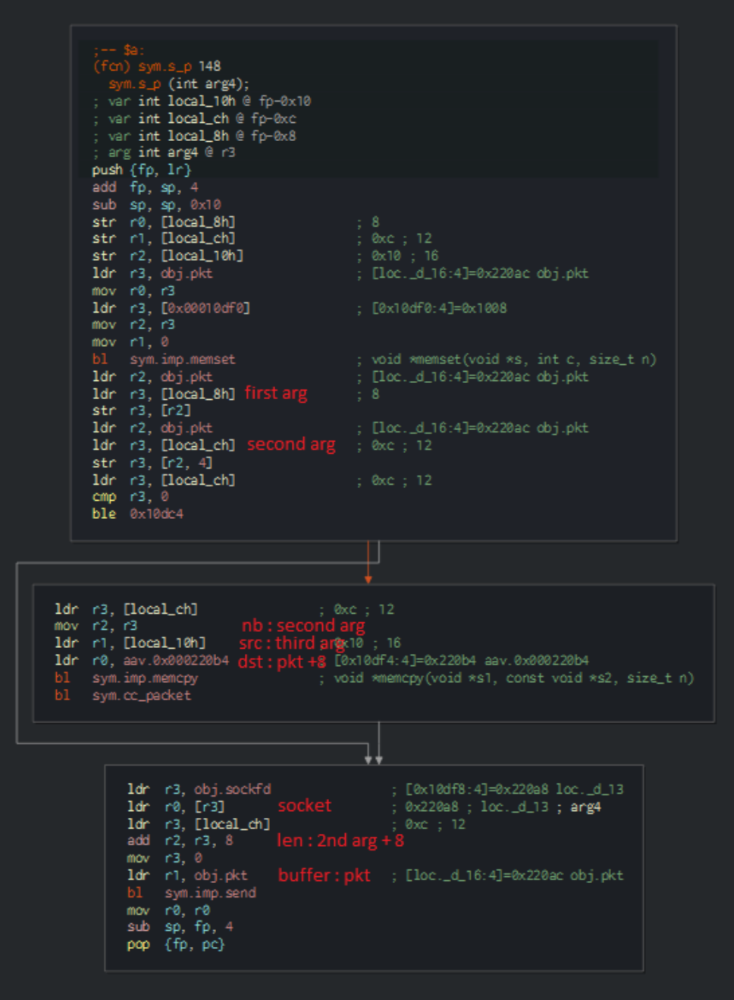

#### Mod_dl

This function contains a big block at the beginning, we can observe that the data size field of “pkt” is extracted, increased by one and then used to perform a malloc. The returned pointer (ptr) is then filled with the data field of “pkt” and the last byte of “ptr” is set to 0. Eventually “fopen” is called using “ptr” as filename, thus we can conclude that the data received is a file name and by the name of the module (dl = download) that this function is sending a file to the other endpoint.

Right after the fopen, the buffer containing the file name is freed and two calls to “fseek” are made with a “ftell” call in-between. This is a way to obtain the file size by seeking at the end of the file, getting the value of the cursor and then putting back the cursor to the beginning of the file.

The file size obtained is then sent using “s_p” with a data size of 4 corresponding to the size of a 32bits integer. We can also conclude by seeing a different value for the first argument of “s_p” than in “mod_pong” that this is determined by the module sending the data and a packet type probably.

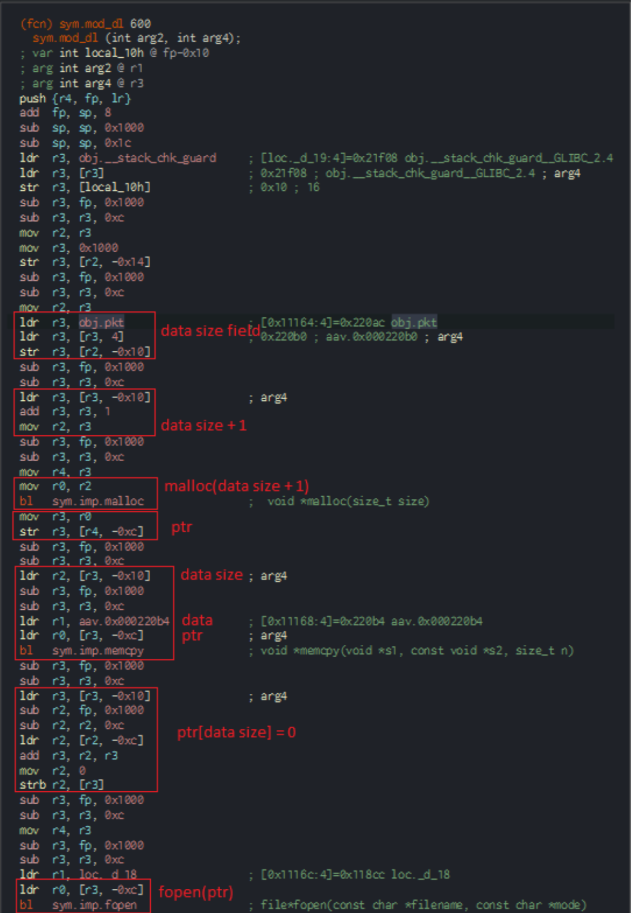

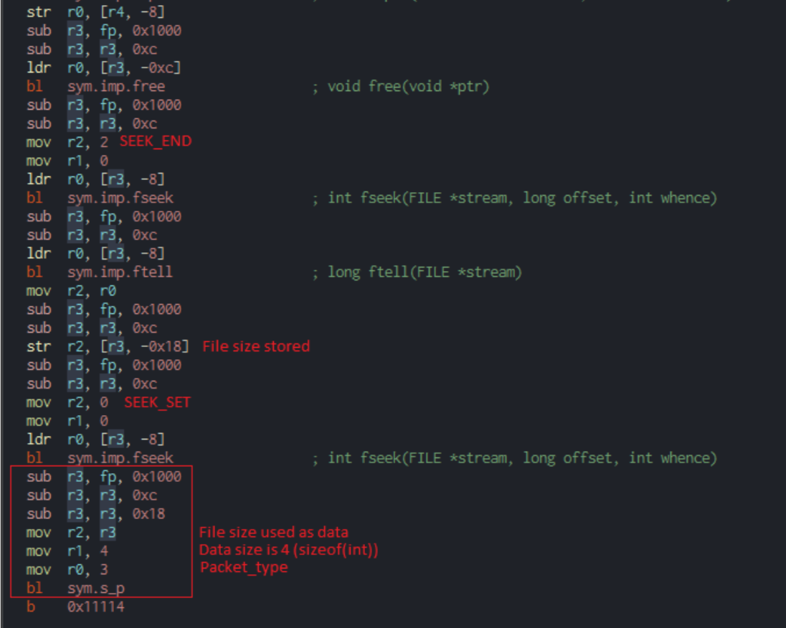

Last part of the function consists in a loop where the file size is used as some sort of iterator and decreased at each file read and packet send. A variable (fp-0x14) is used to determine the number of bytes to read in the file, this variable is set at the beginning of the function to 4096 but is replaced with the file size if this one is less than 4096. Each chunk of the file is sent using “s_p” with packet type 3.

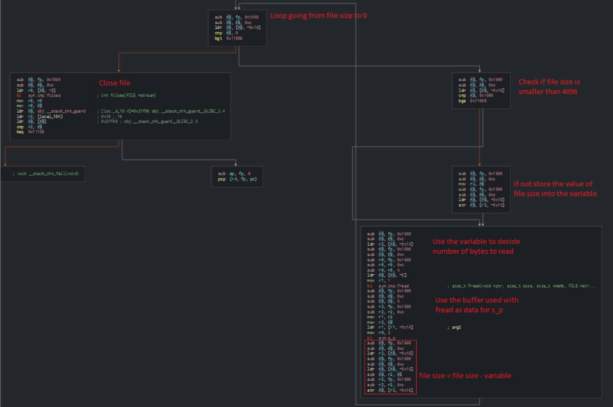

#### Mod_up

This function is similar as “mod_dl” except that it received a file instead of sending one. The “fread” calls are replaced with fwrite and “s_p” with “r_p” and some small differences but in the end the principle is the same.

#### Mod_exe

This function just uses the string received in the packet as a command to a call to “system”

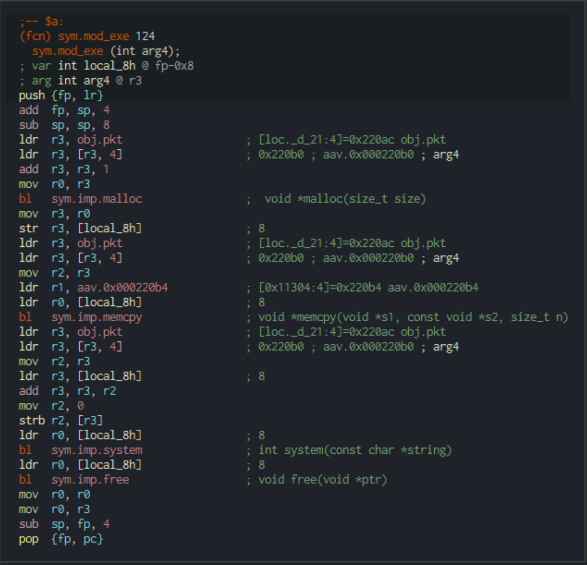

#### Flag

By continuing to decrypt the packet we can decrypt the large chunk of data sent from the device to the attacker.

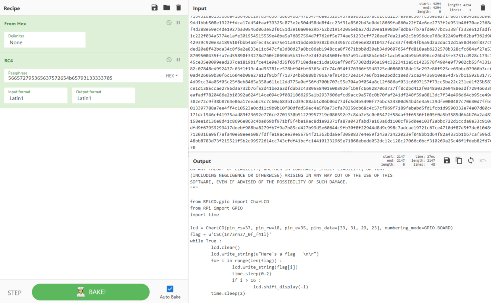

We get the flag by decrypting the first large packet using a counter value of 5. Other packets can be decrypted using the same system, the only rule is that a new packet starts with the two integers header, when a new packet starts the keystream changes, this applies to files sent by chunks.

### Flag
`CSC{1n73rn37_0f_f41l}`

### Creator
Jean-Luc Davenne

