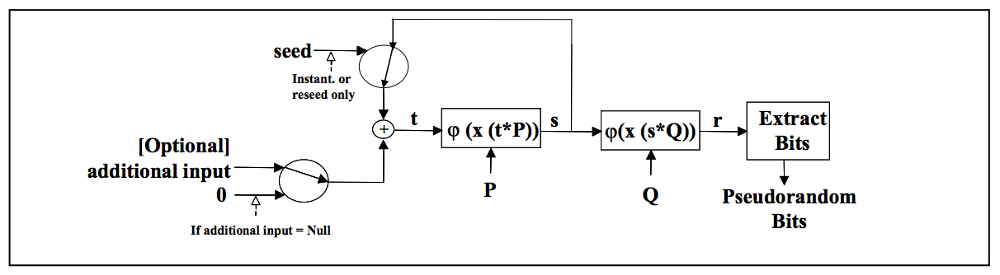

# Introduction
By looking at the code of the ransomware, we can determine that the random generator is Dual_EC_DRBG.

The working of it is quite simple, with two points on a secure elliptic curve P and Q and a random seed, we can generate random bits like so:



It was found that this algorithm could be backdoored by choosing specifics P and Q with a relation such that P=d\*Q (d a large secret number).
By knowing that d and some output of the generator, all the next generated bits could be predicted.

In our virus, the generator is used to create some IVs and keys for the AES encryption of all files.
It also create a serial of 30 bytes.
Being able to predict all the output of the generator will then help us in recovering all the encryption keys used (the IVs are known and stored alongside the files).

# Finding d
The goal is to find such d.
By searching the P `0x65d5b8bf9ab1801c9f168d4815994ad35f1dcb6ae6c7a1a303966b677b813b00`, `0xe6b865e529b8ecbf71cf966e900477d49ced5846d7662dd2dd11ccd55c0aff7f`, point on internet, we can find the [ECPy](https://pypi.org/project/ECPy/) documentation with the same curve, 
By using the k used in the example, `0xfb26a4e75eec75544c0f44e937dcf5ee6355c7176600b9688c667e5c283b43c5`, we can compute the following Q `0x79be667ef9dcbbac55a06295ce870b07029bfcdb2dce28d959f2815b16f81798`, `0x483ada7726a3c4655da4fbfc0e1108a8fd17b448a68554199c47d08ffb10d4b8` which is the one used in ransomware.

# Recovering the internal state
Now that we have our d, we can try to recover the internal state of our CSPRNG.

To do so we need an output of our generator as large as possible.
Hopefully, we have a serial which is the biggest possible bitstream generated by our generator.

Because it's not the same size as the internal state of our generator (30 bytes for the output and 32 for the internal state) we need to bruteforece the last to bytes and test if it's a possible output of the generator (if it create a point on the curve).

Once its done, we can verify we have the correct output by using the relation : `next_state = (d * possible_point).x` and `next_out= (Q * possible_point).x` and then verify it is an IV used in one of our encryption.

If it is then we have successfully recovered the internal state of our generator and can start recovering the encrypted files.

*Python code to recover the internal state:*
```python
from fastecdsa.curve import secp256k1
from fastecdsa.point import Point
from fastecdsa import util
from base64 import b64decode
from glob import glob


serial = 0xf68296d8c49ea3ea9f0db21291bd7c5036876776999b4361fdff6351c15
possible_out = []
for fname in glob("*.key"):
    with open(fname) as f:
        iv = b64decode(f.readline()).hex()
        possible_out.append(iv)


curve = secp256k1
d = 0xfb26a4e75eec75544c0f44e937dcf5ee6355c7176600b9688c667e5c283b43c5
Q = Point(
    0x79be667ef9dcbbac55a06295ce870b07029bfcdb2dce28d959f2815b16f81798,
    0x483ada7726a3c4655da4fbfc0e1108a8fd17b448a68554199c47d08ffb10d4b8,
    curve
)
P = Point(
    0x65d5b8bf9ab1801c9f168d4815994ad35f1dcb6ae6c7a1a303966b677b813b00,
    0xe6b865e529b8ecbf71cf966e900477d49ced5846d7662dd2dd11ccd55c0aff7f,
    curve
)

for i in range(2**16):
    o = (i << (8*30)) | serial

    for sol_to_y in util.mod_sqrt(o**3 + curve.b, curve.p):
        # there are either 2 or 0 real answers to the square root. We reject those greater than p.
        if sol_to_y < curve.p:
            possible_y = sol_to_y
        else:
            possible_y = None
        # first check: if there were 0 solutions we can skip this iteration
    if possible_y == None or type(possible_y) == None:
        print("shit")
        continue

    # second check: is point on curve? if not then skip this iteration
    try:
        possible_point = Point(o, possible_y, curve=curve)
    except:
        continue

    # if checks were passed, exploit the relation between state to calculate the internal state
    i2x = (d * possible_point).x
    # check if the state is correct by generating another output
    P = Q * i2x
    tmp_x = hex(P.x)[2:]
    if tmp_x[32:] in possible_out:
        print("FOUND : " + tmp_x)
        print("State: " + hex(i2x))
        break
```

# Decipher the flag
Now that we can predict all output of the generator, we can use that to regenerate all the keys and IVs used during the encryption to decrypt all the files.

*Python code to decipher all files*
```python
from base64 import b64decode
from glob import glob
from Crypto.Cipher import AES
from ecpy.curves import Curve, Point


state = 0x652475327040c40febc076e3eda189b161e2ef2664c8a681ece927ce668b7186

class Random_generator():
    def __init__(self):
        self.cv = Curve.get_curve('secp256k1')
        self.Q = Point(
            0x79be667ef9dcbbac55a06295ce870b07029bfcdb2dce28d959f2815b16f81798,
            0x483ada7726a3c4655da4fbfc0e1108a8fd17b448a68554199c47d08ffb10d4b8,
            self.cv
        )
        self.P = Point(
            0x65d5b8bf9ab1801c9f168d4815994ad35f1dcb6ae6c7a1a303966b677b813b00,
            0xe6b865e529b8ecbf71cf966e900477d49ced5846d7662dd2dd11ccd55c0aff7f,
            self.cv
        )
        self.seed = state

    def rand(self):
        out = self.Q * self.seed
        self.step()
        return out.x & 0xffffffffffffffffffffffffffffffffffffffffffffffffffffffffffff

    def step(self):
        tmp = self.P * self.seed
        self.seed = tmp.x


def unpad(text):
    length = text[-1]
    return text[:-length]


files = {}
for fname in glob("*.key"):
    with open(fname) as f:
        iv = b64decode(f.readline()).hex()
        files[iv] = fname


generator = Random_generator()

for i in range(len(files)):
    iv = generator.rand() & 0xffffffffffffffffffffffffffffffff
    iv = iv.to_bytes(16, byteorder='big')
    key = generator.rand() & 0xffffffffffffffffffffffffffffffff
    key = key.to_bytes(16, byteorder='big')

    fname = files[iv.hex()]
    aes = AES.new(key, AES.MODE_CBC, IV=iv)
    with open(fname.replace(".key", ".enc"), "rb") as f:
        enc = f.read()
    plain = aes.decrypt(enc)
    plain = unpad(plain)
    with open(fname.replace(".key", ""), "wb") as f:
        f.write(plain)
```

And we can use the flag found in `important_discovery.txt`
