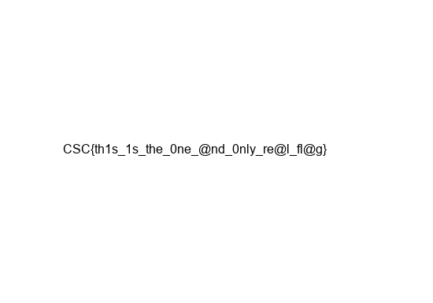

# Write-up challenge "FlagViewer"

## Tools used
- Apktool: https://ibotpeaches.github.io/Apktool/
- Jadx: https://github.com/skylot/jadx

## Walkthrough

### Step 1
We can start by just running the strings command on the apk file, but that returns a lot of useless information, so we skip right to the tool that comes to mind when thinking of apk: Apktool.

Let's use it to decode the apk file:
```
$ apktool d FlagViewer.apk
I: Using Apktool 2.4.0-dirty on FlagViewer.apk
I: Loading resource table...
I: Decoding AndroidManifest.xml with resources...
I: Loading resource table from file: /root/.local/share/apktool/framework/1.apk
I: Regular manifest package...
I: Decoding file-resources...
I: Decoding values */* XMLs...
I: Baksmaling classes.dex...
I: Copying assets and libs...
I: Copying unknown files...
I: Copying original files...
```

When looking at the output, it seems that the decoding process completed sucessfully. The result is stored in the directory FlagViewer.


### Step 2
Time to have a look at what we can find in the directory that was generated by Apktool.

The directory contains two files and 4 directories:


We first have a look at the Android manifest and apktool.yml.

The manifest does not seem to provide a lot of extra information. The apktool.yml file also does not contain anything special, apart from the doNotCompress list containing a raw resources path. This is something interesting enough to look into later. Furthermore, one of the unpacked directories is named kotlin, so we also know that the app was written in Kotlin instead of Java.

Before we start looking at the code to find out what the app exactly does, we have a look at the res directory. This one will for example contain the strings file used by the application. Its path is res/values/strings.xml.

Quite some of the strings have references to flags, which is not abnormal as the application is called FlagViewer. However, nothing that leads us to the flag we want to find.

```bash
$ cat res/values/strings.xml | grep -i flag
    <string name="app_name">FlagViewer</string>
    <string name="button_text">Get flag</string>
    <string name="image_content">Flag</string>
    <string name="view_text">Welcome to FlagViewer!</string>
    <string name="view_text2">This is a flag</string>
    <string name="warning">Emulator detected: you cannot get a flag</string>
```

Another interesting directory is the raw directory. This one will contain the raw resources if any were included in the apk. As we already saw in the file apktool.yaml, there is one file called data. The file does not have an extension and seems to contain binary data.

```
$ ls res/raw/
data

$ head -n 1 res/raw/data 
"�2~�`�'j��b�SF6�*�؇7$��f����ѵE}���#T���֟-3�!:kg5�9�>�nw��SB��r�X>nv̂

$ file res/raw/data
res/raw/data: data
```

The file command also does not provide any further information, so it seems to contain exactly what the name says: data. We assume it is going to be an encryptedfile. To confirm this, we need to have a look at the code.


### Step 3
So let's check the smali directory to see what the code exactly does. This directory does not contain files with Kotlin code, but with smali. Smali is the intermediate representation between dex files and Java/Kotlin code in Android apps. The exact details are not that important to have a closer look.

From the manifest we know the main code will be in com.challenge.flagviewer, so that's what we check first. The directory looks like this:


We start with the MainActivity, which is the first activity of the app that will be loaded and launched. Smali code is not that readable, but the file does not contain that much code and by looking at the method calls we can find out pretty easily what the code is doing as it does not seem to be minified or obfuscated.

Alternatively we can also use jadx to decompile the dex files to java. We can open the apk directly and view the decompiled code through a GUI which makes it a bit easier to read.


The onCreate method is executed on creation of the activity and seems to prepare some views. It uses TextViews, an ImageView and a Button. The most interesting parts are that it performs a check to see if it is running in an emulator and that it creates an instance of another class called Vault.

The only method called on this Vault object is getFlagsFromVault. The main activity thus seems to load flags from a vault and then display them into an ImageView when the button is clicked.

The getFlagsFromVault will be the method responsible for getting the flag images. As we are here looking for a flag, this is the obvious way forward. So let's check the vault.


### Step 4
The smali directory also contains a file called Vault.smali which seems to contains the interesting functionality. For better readability we use jadx again to decompile the dex files to Java. Apart from the method getFlagsFromVault, which was not completely decompiled correctly, it also contains two private methods decrypt and getVaultKey.


The getFlagsFromVault method seems to seems to load the raw resource called data, which is the one we already found included in the apk. Then it calls the getVaultKey method to fetch a SecretKey object that is passed together with the input of the data file to the decrypt method. Afterwards the decrypted data is decrompressed with Gzip and returned.

We need to know how to decrypt the file to get to the flags, so we check the decrypt method. First it gets the cipher name from a base64 encoded string: "QUVTL0NCQy9QS0NTNVBhZGRpbmc=". After decoding we get: "AES/CBC/PKCS5Padding". So it uses AES as encryption algorithm in CBC mode and PKCS5 for padding. The initialization vector is set via IvParameterSpec to a byte array of zeroes.

To be able to decrypt the file ourselves, we now only need to find the encryption key. For this we look at the getVaultKey method. That one returns a SecretKey based on a base64 encoded string: "T3BlblRoZVZhdWx0Tm93IQ==". So after decoding we already found the key used for decryption: "OpenTheVaultNow!". It was a bad idea to hard code this encryption key, but good for us.

So we now know everything to perform the decryption process ourselves.

### Step 5
Time to break this vault! Let's write a small python script to perform the same steps as the Android application did to decrypt and decompress the data file.

```python
#! /usr/bin/env python3
import os
import base64
import gzip
from cryptography.hazmat.primitives.ciphers import Cipher, algorithms, modes
from cryptography.hazmat.backends import default_backend 
from cryptography.hazmat.primitives import padding

with open('data', 'rb') as f:
	data = f.read()

# prepare decryption
backend = default_backend()
key = b"OpenTheVaultNow!"
iv = b"\x00" * 16

# perform decryption
cipher = Cipher(algorithms.AES(key), modes.CBC(iv), backend=backend)
decryptor = cipher.decryptor()
pt = decryptor.update(data) + decryptor.finalize()

# perform unpadding
unpadder = padding.PKCS7(128).unpadder()
pt = unpadder.update(pt) + unpadder.finalize()

# decompress data
original_data = gzip.decompress(pt)

# write to file
with open('original_data', 'wb') as f:
	f.write(original_data)
```

When checking the resulting file "original_data" we notice that we have a file with 1000 base64 encoded strings. All of them start with the same sequence and when we decode the first line we see that they start with PNG.

```
$ head -n 1 original_data | base64 -d | head -c 10
�PNG
�
```

As expected this file contains all the flag images that are displayed by the application as base64 strings.

Let's decode them and write them each to a separate file, so we can find the flag we want. We extend the script to also extract the images to separate files.

```python
extracted_dir = "extracted_images"
if not os.path.isdir(extracted_dir):
	os.mkdir(extracted_dir)

for i, line in enumerate(original_data.decode("UTF-8").split('\n')):
	img = base64.b64decode(line)
	with open(os.path.join(extracted_dir, "flag_{}.png".format(i)), 'wb') as f:
		f.write(img)
```

We now have the 1000 images in the directory extracted_images:


We can indeed see that all of those images are flags, flags of countries, but also images with CSC flags. We wanted a flag and we got a lot of flags, but we still need to find the one we want. We can start going through all of them one by one, but there are quite a lot of them. To make our lives a little bit easier we can filter some of them out. Apparently the white flags are very beautiful to see, so let's focus on those.

Alternativly, we could also try to use OCR to read the text from the images and find the flag like that, but as the filtering is probably sufficient we take the approach with minimal effort.

### Step 6
So let's filter out all the flags with a white background. We write a small python script that checks if the first pixel of every image is white. If this is the case, we write those images into another directory called white_flags.

```python
#! /usr/bin/env python3
import os
import sys
from PIL import Image

if len(sys.argv) > 1:
	flag_dir = sys.argv[1]
else:
	flag_dir = '.'

white_flag_dir = 'white_flags'

if not os.path.isdir(white_flag_dir):
	os.mkdir(white_flag_dir)

# loop over all flag images
for root, _, filenames in os.walk(flag_dir):
	for filename in filenames:
		if not filename.endswith('.png'):
			continue
		img = Image.open(os.path.join(root, filename))
		pixels = img.load()
		# check for white pixel	
		if pixels[0,0] == (255, 255, 255):
			img.save(os.path.join(white_flag_dir, filename))
```

After running the script we check the images in the directory white_flags. We only have 116 left. Time to view some flags!


When checking these flags, we finally find the one we were looking for, the one and only real flag!



The flag is: CSC{th1s_1s_the_0ne_@nd_0nly_re@l_fl@g}

It's indeed a very beautiful flag.
