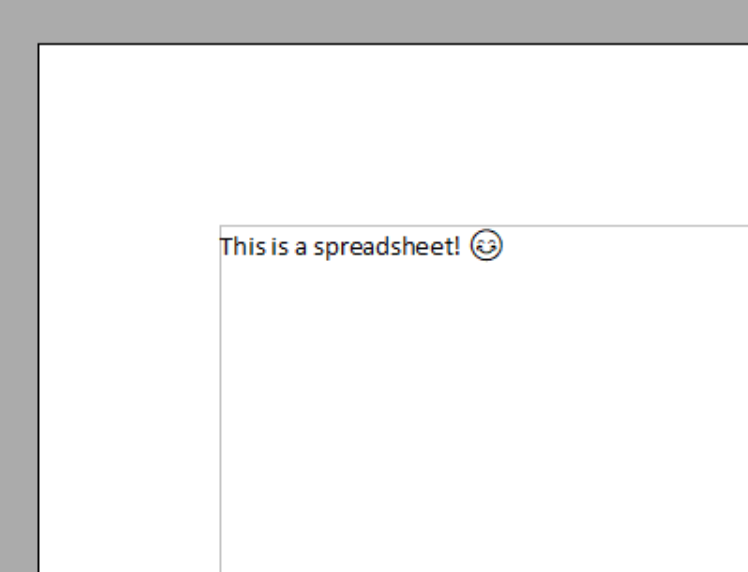
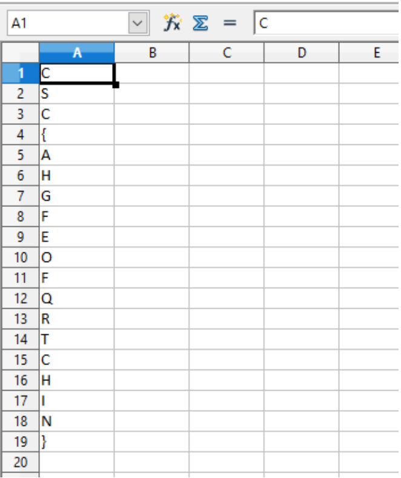

# polyglot.doc
  
## Didier Stevens
# Description:

This document was found on VirusTotal, and our researchers couldn’t figure out what kind of document this is. We hope you are more successful.
  

## Solution
This is a simple challenge, when the document is opened with Word, the following text can be seen:

When the extension is changed from .doc to .xls, and then opened with Excel, the following text can be seen:

This file can also be opened with OpenOffice to obtain the same result (in fact, the screenshots were taken from OpenOffice).

Tools like oledump.py can also be used to find the solution, but opening with an Office application is much quicker.