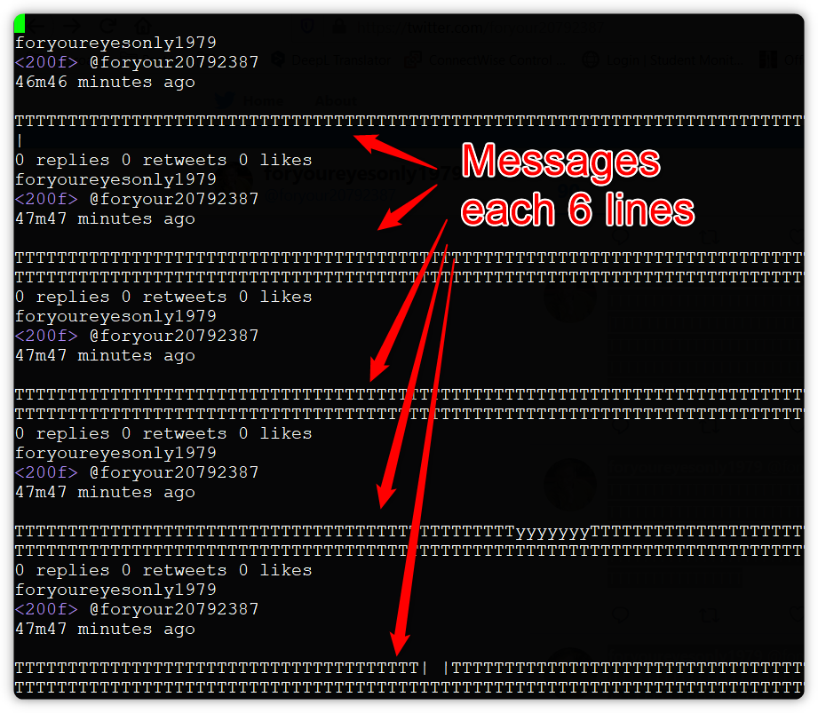
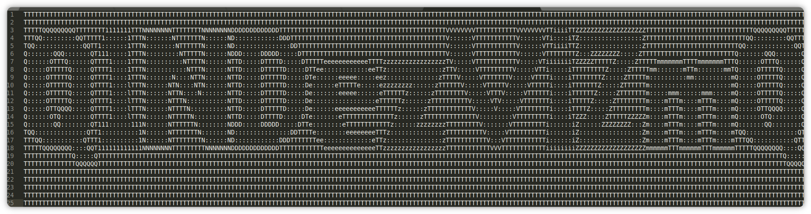

# The Shamelss Challenge

## Description

The Security Officer is on vacation and unreachable. Your boss asked you to retrieve data stored on an encrypted drive managed by the Security Officer.Unfortunately, the only documentation you found is reduced to 2 links: 

* https://pastebin.com/rkDSgRkF
* https://en.wikipedia.org/wiki/Secret_sharing

## Solution

### Social media research

The subtile reference to find in the description is about "Shamir Secret Sharing".
We get a first link to Pastebin with a first sharing key starting with '4'.

We can deduce there are at least 4 keys to found.
We can get the name of the account on Pastebin, than try that username on other media to find other accounts.

Here are the 4 links that can be found:
1-Facebook https://www.facebook.com/shassha1979
2-Twitter https://twitter.com/shassha1979
3-Pinterest https://www.pinterest.com/shassha1979/
4-Pastebin https://pastebin.com/rkDSgRkF

### Decrypt the shared secret

In fact, finding 3 of the 4 keys is sufficient to decrypt the message.
The keys can be found in images posted on the different accounts (except of Pastebin):

```
1-d71f07c7f934f73b2dd32b90f57012580b198cd6a6282adece628cd31ba86cbd27c070
2-ee2f118884ce06dda892aff3fa8969c909951d9d510f4bd0fbcdf9fce902ddbc76b1d8
3-04a95231b8e74550a671ebf35fdda93d960c2d6ebdaad13fa8eeed8c4f83e80f9670f6
4-801ea582a0be05a76de4cedc856f4e552634fe2a76af7f0c53707ce571d9ef3e64a1d1
```

They can be combined using the package 'ssss' on linux, or online using, for example, http://point-at-infinity.org/ssss/demo.html/

We get the following link:

```
https://twitter.com/foryour20792387
```

### Last phase

1. Go to https://twitter.com/foryour20792387
2. Scroll all the tweet, then select all the tweets at once and copy past in a document (here for example "copypaste.txt"


3. If we open the document, we can see that the message is placed at each 6 lines



4. We can print each 6 lines, revert the order (because of Twitter ordering), use the "|" as separator and remove any whitespace and carriage return

```
cat copypaste.txt | sed -n '6~6p' | tac | tr '\n' ' ' | sed 's/| |/|\n|/g' | sed 's/ //g' | sed 's/|//g' > copypaste_cleaned_reversed.txt
```

5. Once we open the file in a text editor (without word wrap), we can horizontally scroll to see a base64 sequence.



6. Reversing the base64 code can give some weirds artefacts, or error in the flag format. In fact, to find the good sequence, we must try to replace the '1' with 'l' and '0' by 'O'.

```
$ echo QlNDezViZmQyYWQz0Dk2NGQ00TUyYzk3MWQyMGIxYmVkOWUwfQo= | base64 -d
BSC{5bfd2ad3▒964d4▒52c971d20b1bed9e0}
```

7. At the end, we are able to correct the artifact and find the correct flag:

```
$ echo Q1NDezViZmQyYWQzODk2NGQ0OTUyYzk3MWQyMGIxYmVkOWUwfQo= | base64 -d
CSC{5bfd2ad38964d4952c971d20b1bed9e0}
```

### About the creator

*Name*: Dimitri Diakodimitris
*Occupation*: Cyber Security Profesional, Whitehat, Hi-Tech enthousiast ... but above all a GEEK ;-) 
*Characteristic*: Addiction to coffee and pizza, ... do not feed him after midnight !

If you want to reach him:
* Linkedin: https://www.linkedin.com/in/dimitridiakodimitris/
* GitHub: https://github.com/ddiako
* Twitter: https://twitter.com/ddiako

