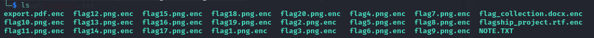
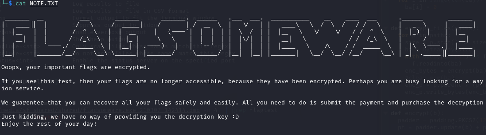
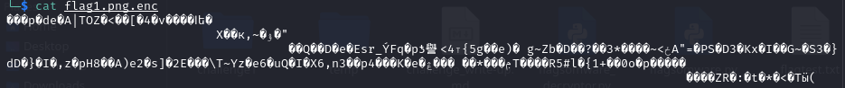
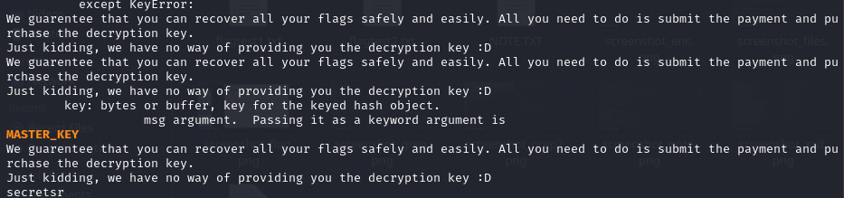
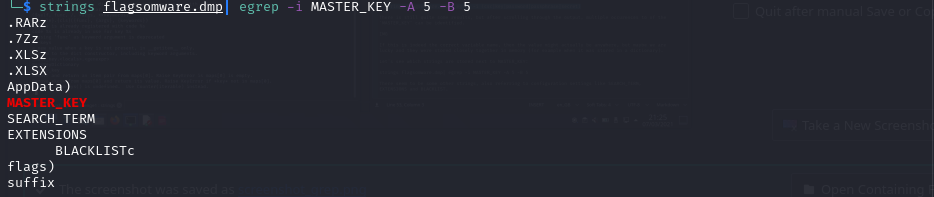
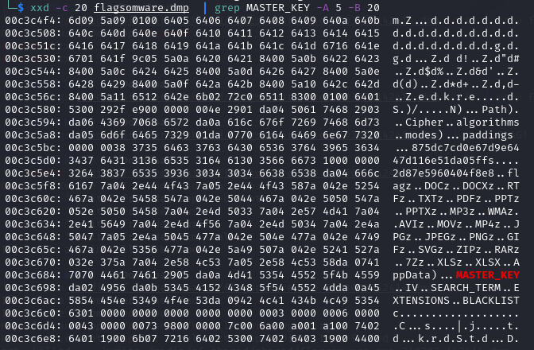
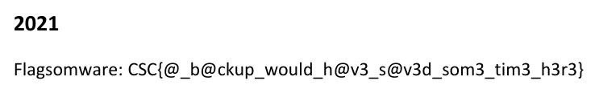

# Write-up challenge Flagsomware

## Introduction
I was participating in my favorite CTF and downloaded a tool from the internet. The tool didn't work, but since then I have not been able to access some of my files. It's weird, because all my other files are fine. Unfortunately for me the files I can no longer open contain important information. I guess the tool must have contained some malware. It was still running, so I was able to dump the process memory. Maybe you can still recover my files?

## Tools used
- strings
- grep
- xxd
- python

## Walkthrough

### Step 1
Let's have a quick look at the files that were provided to us:



All files seem to have the .enc extension but one NOTE.txt file:



The signs were already quite obvious, but the note confirms it: ransomware.
More specifically, it seems to be ransomware that only encrypts files related to flags.
Apparently we are not the only ones looking for flags.

Let's quickly open a file to confirm that it's not a fake ransomware:



Nope, that's indeed looks encrypted.


### Step 2
Now we can have a look at the process memory dump.
With the strings command we can try to get some more information.

```bash
$ strings flagsomware.dmp
Output omitted
```

Based on the output we can see that it seems to be an executable containing python code.
Also, we could have guessed that they used AES encryption, but the strings output already seems to confirm this.


### Step 3

To decrypt the files we will need to get our hands on the decryption key. Let's take a look if we can extract it from the memory dump of the malicious process.

We could try to run specific tools searching for secrets like keys and passwords in the dump, but if it's a randomly generated key, that might give a lot of results and require us to try them all.

So let's first see if we can find references to the key with some strings and grep magic.

```
$ strings flagsomware.dmp | egrep -i (csc|key|password|passphrase|secret)
```

There is still quite some results, but after scrolling through the output, multiple occurences to  the string 'MASTER_KEY' can be identified.



If this is indeed the correct variable name, then the value might actually be anywhere, but maybe we are lucky and they were stored closely together in memory (for example when it was stored in a dictionary).

Let's see which strings are stored next to 'MASTER_KEY':

```
$ strings flagsomware.dmp | egrep -i MASTER_KEY -A 5 -B 5
```



There seem to be some other strings, which could also be related to configuration settings: 'SEARCH_TERM', 'EXTENSIONS' and 'BLACKLIST'.


### Step 4

Now that we have identified a potential location where the encryption key might have been located in memory, let's focus on the area around the 'MASTER_KEY' string with xxd.

```
$ xxd -c 30 flagsomware.dmp  | grep MASTER_KEY -A 5 -B 10
```



This looks like a dictionary structure and the keys seem to be stored after their values.

```
BLACKLIST => AppData
EXTENSIONS => List of extensions: .DOC -> XLSX
SEARCH_TERM => flag
IV => 2d87e5960404f8e8
MASTER_KEY => 875dc7cd0e67d9e6447d116e51da05ffs
```

For the first 3 keys the values definitly make sense, which means the values for IV and MASTER_KEY should be correct too.


### Step 5
Let's try to decrypt the files by using the identified encryption key and initialization vector as parameters for the AES algorithm.

We can for example easily write a python script for this:

```python
from pathlib import Path

from cryptography.hazmat.primitives.ciphers import Cipher, algorithms, modes
from cryptography.hazmat.primitives import padding


key = b"875dc7cd0e67d9e6447d116e51da05ff"
iv = b"2d87e5960404f8e8"


def get_encrypted_paths():
  return  [p for p in Path().glob('*.enc')]
  
  
def decrypt_files(paths):
  for p in paths:
    with open(p, 'rb') as f:
        dec_bytes = decrypt(f.read())
    dec_path = p.parent / (p.name[:-4])
    dec_path.write_bytes(dec_bytes)


def decrypt(b): 
  # perform decryption
  cipher = Cipher(algorithms.AES(key), modes.CBC(iv))
  decryptor = cipher.decryptor()
  dec = decryptor.update(b) + decryptor.finalize()

  # perform unpadding
  unpadder = padding.PKCS7(128).unpadder()
  plain = unpadder.update(dec) + unpadder.finalize()
  
  return plain


def main():
  decrypt_files(get_encrypted_paths())
  
  
if __name__ == "__main__":
    main()
```
    
Running this writes the decrypted content to files with the same name, but with the original extension.

This is what needed to be done and when we go through the files we find the flag for this challenge on the second page of the export.pdf file, likely an older export to pdf of the docx file.




The flag is: CSC{@_b@ckup_would_h@v3_s@v3d_som3_tim3_h3r3}


